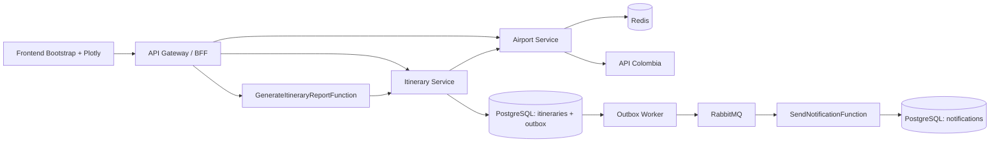

# Sistema de Itinerarios Personales

## Arquitectura y límites

Cada carpeta en `services/` es un bounded context. Las entidades y puertos de `domain/` son Python puro; `application/` implementa los casos de uso; `infrastructure/` conecta HTTP, SQL, caché y mensajería; `api/` contiene los puertos de entrada FastAPI. Los servicios se construyen y prueban por separado.

`shared/` es un paquete instalable para contratos de transporte Pydantic, JWT y observabilidad. No comparte entidades ni repositorios de dominio. Cada imagen instala una copia; cambiar el contrato exige mantener compatibilidad o versionar el evento. En desarrollo, los nombres de código estén en inglés y la interfaz/documentación en español.



Solo el gateway publica un puerto de aplicación. El frontend llama exclusivamente a `/api/*` en su mismo origen. Los paneles locales de Jaeger/RabbitMQ estén restringidos a loopback. Render utiliza servicios privados para Airport, Itinerary y Report.

## Decisiones

1. **AirportColombiaAdapter:** consulta API Colombia con httpx asíncrono, timeout de 8 s, tres intentos para errores de transporte/429/5xx y espera exponencial. Un circuito por proceso abre tras tres operaciones fallidas y permite recuperación después de 30 s. Los 4xx distintos de 429 no se reintentan.
2. **Caché:** `airports:fresh` dura una hora; `airports:stale` dura 24 horas desde la última respuesta válida. Tras fallar el proveedor se utiliza esta segunda copia si aún existe. Redis caído no impide usar un proveedor sano. Sin proveedor ni respaldo se devuelve 503.
3. **Normalización:** API Colombia tiene registros con ejes geográficos intercambiados (verificado con Rionegro). Solo se intercambian si la supuesta latitud está entre -82 y -66 y la supuesta longitud entre -5 y 14. Coordenadas no numéricas/fuera del rango mundial se convierten en null; esos registros siguen disponibles en la lista. `N/A` en IATA se normaliza a null.
4. **Transactional Outbox:** la unidad de trabajo persiste agregado y evento con una única sesión/transacción SQLAlchemy. Un error de cualquier escritura revierte ambas. No se usa RabbitMQ dentro de la solicitud HTTP.
5. **Entrega al menos una vez:** el worker bloquea lotes con `FOR UPDATE SKIP LOCKED`, usa mensajes persistentes y publisher confirms, y marca `published_at` después de publicar. La topología durable se declara también desde el publicador para que una notificación no se pierda si el consumidor aún no arrancó. Si el proceso cae entre confirmación y commit, se repite el evento.
6. **Idempotencia:** `notifications.event_id` es clave primaria. El consumidor confirma (ACK) después del commit y solo registra una notificación por evento. Mensajes inválidos se rechazan a `notifications.dead`; fallos transitorios de almacenamiento se reencolan con una pausa. El envío es simulado por registro persistido/log; no se envía correo real.
7. **Adaptación serverless a Render:** Notification y Report son unidades independientes activadas respectivamente por evento y HTTP, con su propio Dockerfile. Se despliegan como Background Worker y servicio HTTP privado. Representan el modelo conceptual de funciones; **no son FaaS reales**, no garantizan ejecución efímera, escalado a cero ni facturación por invocación. El contenedor mantiene un proceso activo.
8. **Reporte:** consulta el Itinerary Service mediante HTTP y propaga el JWT, sin acceder a su base. Consolida itinerarios, días, promedio y frecuencias de ruta del usuario. Usa páginas de 100; es un reporte en vivo sin snapshot transaccional entre páginas.
9. **Autenticación:** login demostrativo de una cuenta configurada por entorno; JWT HS256 con issuer, audience, subject, issued-at y expiración de 60 minutos. Gateway y servicios HTTP internos validan el token. Las operaciones CRUD filtran por sujeto; no se confía en un user_id enviado por el cliente. No incluye registro, recuperación de contraseña ni refresh tokens.
10. **Rate limiting:** ventanas de 60 s en Redis mediante Lua atómico, 120 solicitudes API/minuto/IP y 10 intentos de login/minuto/IP. Se comparte entre réplicas; sin Redis, el gateway responde 503. No se confía en encabezados de IP aportados por el cliente; detrás de un proxy el límite puede agrupar clientes por IP del proxy. Para límites individuales en producción, configurar explícitamente proxies confiables.
11. **Observabilidad:** instrumentación FastAPI y httpx, OTLP/HTTP hacia Jaeger, contexto W3C guardado en outbox y extraído por publicador/consumidor. Logs JSON con trace_id, span_id y correlation_id. Sin un exportador configurado no se envían trazas. Health checks son de vida, no garantizan que todas las dependencias estén disponibles.

## Ejecución local

Requisitos: Python 3.11+ para utilidades; Docker Engine y Compose v2 para el sistema. Desde la raíz:

```sh
python scripts/init_env.py
docker compose --env-file .env -f infra/docker-compose.yml up --build -d
docker compose --env-file .env -f infra/docker-compose.yml ps
```

El inicializador crea `.env` a partir de `.env.example` y genera contraseñas hexadecimales aleatorias; no imprime secretos ni sobrescribe un archivo existente. Consulta el archivo local para ingresar con `DEMO_USERNAME`/`DEMO_PASSWORD`. No hay credenciales embebidas en código. Las contraseñas manuales para URLs deben codificarse si contienen caracteres reservados.

Compose espera a PostgreSQL/RabbitMQ/Redis y ejecuta migraciones en contenedores de una sola ejecución antes de iniciar los servicios que usan esas tablas. Conserva bases y colas en volúmenes; Jaeger usa almacenamiento de desarrollo en memoria.

| Recurso | Dirección |
| --- | --- |
| Interfaz | http://localhost:8000 |
| Swagger gateway | http://localhost:8000/docs |
| Jaeger | http://localhost:16686 |
| RabbitMQ Management | http://localhost:15672 |

RabbitMQ usa `RABBITMQ_USER`/`RABBITMQ_PASSWORD`. Los servicios internos ofrecen `/docs`, `/openapi.json` y `/health` en su puerto 8000 dentro de la red Docker. No se agrega dinámicamente el Swagger interno: el gateway documenta explícitamente sus rutas públicas.

```sh
docker compose --env-file .env -f infra/docker-compose.yml logs -f outbox-worker notification-function
docker compose --env-file .env -f infra/docker-compose.yml exec notification-db psql -U notifications -d notifications -c "SELECT event_id, itinerary_id, created_at FROM notifications ORDER BY created_at DESC LIMIT 10"
docker compose --env-file .env -f infra/docker-compose.yml down
```

`down` conserva los volúmenes. Para inspeccionar fallos del broker, revisar `notifications.dead` en Management. La retención de outbox publicado/historial no se automatiza en esta versión; definir archivado y límites antes de uso prolongado.

## API pública

Todas las rutas salvo login/health/frontend requieren `Authorization: Bearer <JWT>`.

| Método | Ruta gateway | Resultado |
| --- | --- | --- |
| POST | /api/auth/login | access_token, token_type, expires_in |
| GET | /api/airports | aeropuertos adaptados |
| GET | /api/airports/{id} | aeropuerto |
| POST | /api/itineraries | creación, 201 |
| GET | /api/itineraries?offset=0&limit=100 | lista del usuario |
| GET | /api/itineraries/{uuid} | detalle |
| PUT | /api/itineraries/{uuid} | reemplazo de los datos editables |
| DELETE | /api/itineraries/{uuid} | eliminación, 204 |
| GET | /api/reports | consolidado del usuario |

Ejemplo de cuerpo para crear/actualizar (sustituir IDs por los devueltos por el catálogo):

```json
{
  "departure_airport_id": 1,
  "arrival_airport_id": 2,
  "departure_date": "2027-01-15",
  "duration_days": 4
}
```

La duración se mide en días enteros, de 1 a 365. Salida y llegada deben ser diferentes y existir. Se admiten fechas pasadas para conservar itinerarios históricos. Un ID ajeno se trata como inexistente.

- **400:** regla de negocio o aeropuerto inexistente.
- **401:** credenciales/token incorrectos, ausentes o vencidos.
- **404:** itinerario/aeropuerto no encontrado.
- **422:** formato, rango, UUID, fecha o paginación inválidos.
- **429:** límite de solicitudes.
- **503:** proveedor, almacenamiento, dependencia HTTP o rate limiter no disponible.

El frontend guarda el JWT en sessionStorage, lo elimina al salir o recibir 401 y no inserta datos de usuario/proveedor con innerHTML. Plotly/Bootstrap y la cartografía base requieren acceso a sus CDN. Si no carga Plotly, permanece disponible la lista de aeropuertos.

## Desarrollo aislado y pruebas

Cada servicio tiene su propio entorno y paquete `app`; no ejecutar pytest sobre todas las carpetas en el mismo proceso. Para Airport, por ejemplo, desde la raíz:

```sh
python -m venv .venv
# Linux/macOS: source .venv/bin/activate
# PowerShell: .venv\Scripts\Activate.ps1
python -m pip install -e shared -r requirements-dev.txt -r services/airport-service/requirements.txt
cd services/airport-service
python -m pytest --cov=app -q
# Configurar JWT_SECRET y REDIS_URL para ejecución real:
python -m uvicorn app.main:app --port 8001
```

Para otro servicio, instalar su propio requirements.txt. Las variables se leen del entorno o de `.env` en el directorio del servicio. El `.env` raíz alimenta Compose y no se hereda automáticamente al ejecutar uvicorn desde otra carpeta.

Para verificar todo desde la raíz en un solo entorno:

```sh
python -m pip install -e shared -r requirements-dev.txt -r services/airport-service/requirements.txt -r services/itinerary-service/requirements.txt -r services/api-gateway/requirements.txt -r services/notification-function/requirements.txt -r services/report-function/requirements.txt
python -m ruff check .
python -m ruff format --check .
python scripts/test_all.py
python scripts/check_migrations.py
python scripts/check_contracts.py
```

Las pruebas HTTP usan AsyncClient/ASGITransport, dobles de puertos y respx. La integración SQL usa SQLite asíncrono para validar commits/rollback, CRUD/outbox e idempotencia. Los tests de publicación verifican confirmación antes de marcar y reintento tras error. **SQLite no valida la concurrencia específica de PostgreSQL ni reemplaza pruebas del broker real.**

La prueba de humo con infraestructura real usa un catálogo de prueba determinista, sin depender de la disponibilidad de API Colombia:

```sh
docker compose --env-file .env -f infra/docker-compose.yml -f infra/docker-compose.test.yml up --build -d
python scripts/smoke.py
```

El override solo es para pruebas. Para volver al proveedor real, ejecutar `up -d` usando únicamente el archivo principal. La prueba crea y elimina un itinerario de prueba y verifica que outbox y notificación queden persistidos.

## Migraciones

Alembic está configurado de forma independiente en Itinerary y Notification. Las revisiones iniciales crean explícitamente tablas y restricciones; el arranque de la API no crea tablas automáticamente.

Desde el directorio del servicio, con `DATABASE_URL` (Itinerary) o `NOTIFICATION_DATABASE_URL` (Notification):

```sh
alembic upgrade head
alembic revision --autogenerate -m "describe change"
```

Revisar toda migración generada antes de aplicarla. Para desarrollo individual el outbox se arranca con `python -m app.infrastructure.outbox_worker` desde Itinerary, y Notification con `python -m app.main` desde su carpeta.

## Despliegue en Render

1. Publicar el repositorio y fusionar `Develop` en `main` cuando corresponda. El Blueprint y los hooks siguen `main`.
2. Crear un Blueprint desde `render.yaml`. Declara gateway Web Service, servicios HTTP privados, dos workers, dos Render Postgres y Render Key Value. No fija planes: revisar los recursos/costos elegidos en Render.
3. Render genera un único JWT_SECRET en el grupo compartido. Ingresar DEMO_USERNAME y DEMO_PASSWORD (mínimo 12 caracteres) para el gateway.
4. Configurar la misma RABBITMQ_URL externa para Outbox y Notification, preferiblemente `amqps://`. RabbitMQ no se declara como servicio gestionado; debe existir un broker externo con colas durables. No usar un contenedor sin disco para mensajería persistente.
5. Configurar OTEL_EXPORTER_OTLP_ENDPOINT por servicio apuntando a un Jaeger/Collector externo accesible (URL base OTLP HTTP, sin `/v1/traces`). Jaeger tampoco se ofrece como servicio gestionado de Render. Para una demostración sin trazas puede dejarse vacío.
6. Postgres/Key Value se conectan con referencias del Blueprint. Las URLs de Render Postgres se normalizan a `postgresql+asyncpg://`. Las referencias `hostport` de servicios privados reciben el prefijo HTTP en el adaptador. No se depende de interpolación de variables en YAML.
7. Itinerary y Notification ejecutan `alembic upgrade head` como preDeployCommand. El worker outbox reintenta si su base aún no está migrada. Mantener esquema/eventos compatibles durante despliegues independientes.
8. Configurar estos secrets en GitHub: RENDER_DEPLOY_HOOK_AIRPORT, RENDER_DEPLOY_HOOK_ITINERARY, RENDER_DEPLOY_HOOK_OUTBOX, RENDER_DEPLOY_HOOK_GATEWAY, RENDER_DEPLOY_HOOK_NOTIFICATION, RENDER_DEPLOY_HOOK_REPORT.

CI ejecuta Ruff, formato y pytest/cobertura por servicio en Python 3.11 y 3.12; otro job valida, construye y ejecuta la prueba de humo con Compose y un catálogo de prueba. Deploy se activa cuando CI finaliza correctamente para un push a main. El autodeploy de Render está desactivado para no saltarse ese paso. Los hooks solicitan un despliegue; no esperan a que finalice ni garantizan que todos los servicios actualicen al mismo tiempo. La activación inicial del Blueprint sí requiere revisar su estado en Render.

## Trazabilidad

| Requerimiento | Implementación principal | Verificación |
| --- | --- | --- |
| RF-01, RF-13, RF-14 | Airport service/adapter/cache | tests Airport: caché, respaldo, adaptación, reintentos |
| RF-02 | frontend/app.js, Plotly scattergeo | lista filtrable y mapa, validación manual/navegador |
| RF-03–RF-06 | ItineraryService y API CRUD | integración SQL/HTTP, actualización y eliminación |
| RF-07 | AirportHttpClient | IDs inexistentes, fallo HTTP, token propagado |
| RF-08 | SqlUnitOfWork + outbox_worker | rollback conjunto, publicación confirmada |
| RF-09 | consumer + SqlNotificationRepository | evento repetido, ACK posterior al commit, dead letter |
| RF-10 | GenerateItineraryReportFunction | métricas vacías/no vacías y paginación |
| RF-11–RF-12 | GatewayService, TokenService | proxy HTTP, JWT, aislamiento, rate limiting |

## Fuentes técnicas

- [API Colombia, repositorio oficial](https://github.com/Mteheran/api-colombia) y [catálogo Airport](https://api-colombia.com/api/v1/Airport).
- [Render Blueprint: tipos de servicio, referencias y secretos](https://render.com/docs/blueprint-spec).
- [OpenTelemetry Python: exportadores OTLP](https://opentelemetry.io/docs/languages/python/exporters/).
- [Jaeger: recepción OTLP HTTP en 4318](https://www.jaegertracing.io/docs/2.1/apis/).
- [Circuitbreaker: compatibilidad asíncrona](https://pypi.org/project/circuitbreaker/).
